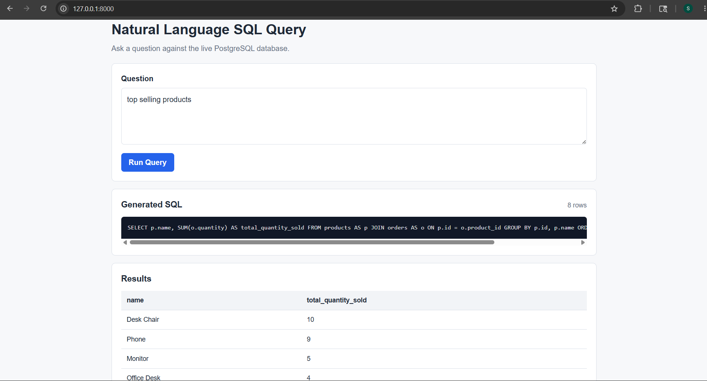

# Natural Language PostgreSQL Query API

FastAPI application that accepts natural language questions, introspects a live PostgreSQL schema at runtime, generates SQL using the NIA API, validates query safety, executes read-only SELECT queries, and returns JSON results.

Database access uses a shared SQLAlchemy engine with connection pooling and lightweight production hardening for generated SQL execution.

## Demo



## Setup

1. Create `.env` from `.env.example`.
2. Set:
   - `DATABASE_URL`
   - `NIA_API_KEY`
3. Install dependencies:

```bash
pip install -r requirements.txt
```

## Run

```bash
uvicorn main:app --host 127.0.0.1 --port 8000 --reload
```

Open the demo UI:

```text
http://localhost:8000/
```

Open Swagger UI:

```text
http://localhost:8000/docs
```

## Endpoints

### `GET /schema`

Dynamically reads PostgreSQL schema metadata from `information_schema.columns`.

### `POST /query`

Request:

```json
{
  "question": "Show the first 10 records"
}
```

Response:

```json
{
  "sql": "SELECT ...",
  "rows": [],
  "row_count": 0
}
```

## Safety Features

The API keeps generated SQL execution read-only and bounded:

- Executes queries inside a read-only transaction.
- Allows only single-statement `SELECT` queries.
- Blocks dangerous SQL keywords and selected PostgreSQL functions.
- Applies a 10-second PostgreSQL `statement_timeout`.
- Limits returned results to 500 rows.
- Introspects the live PostgreSQL schema dynamically from `information_schema`.

## Production Hardening

The current implementation preserves the lightweight architecture while adding practical safeguards:

- Pooled SQLAlchemy engine with stale-connection checks.
- Bounded database query runtime through `statement_timeout`.
- Bounded response size through row limiting.
- LLM request timeout, response token limit, and generic upstream error handling.
- Generic client-facing database errors with server-side logging.

## Development Workflow

- `master` is the stable assessment baseline.
- `development` is the branch for ongoing improvements and hardening work.
